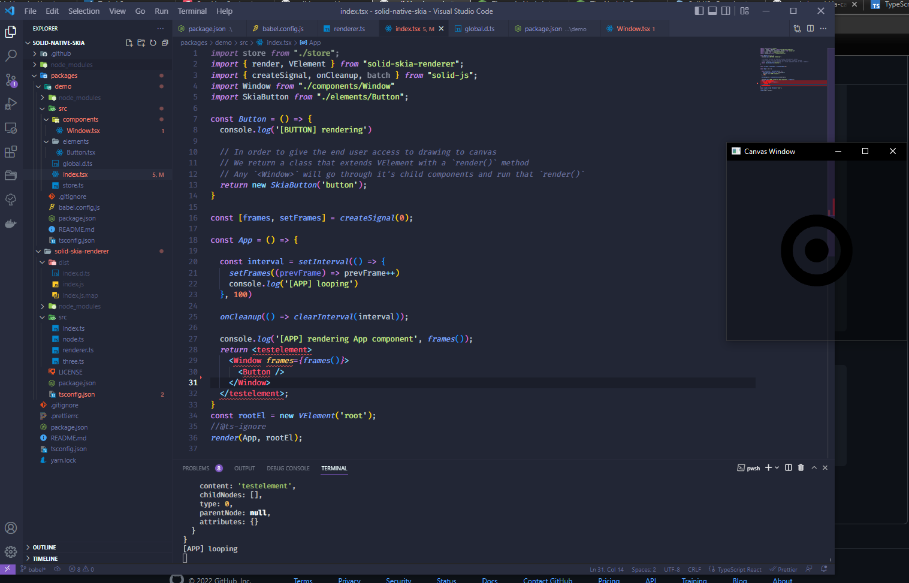

# Solid Skia Renderer

Custom renderer for SolidJS using [skia-canvas](https://github.com/samizdatco/skia-canvas). Write JSX, render directly to the canvas, no DOM required.

This is setup with a Semantic Release workflow based off Conventional Commits. And it's automatically released to Github and NPM using Github Actions.

## Quick Start

1. Fork/clone this repo: `https://github.com/whoisryosuke/solid-skia-renderer.git`
1. `yarn` - Install NPM dependencies.
1. `yarn build` - Build the universal renderer module.
1. `yarn start` - Start the NodeJS example project.

You should see a GUI popup in a small window.

> The process will keep running in console, you can close it using `CTRL/CMD + C`.

## How it works

At a high level, the app breaks down to this flow:

1. We run NodeJS.
1. skia-canvas takes over the NodeJS I/O with it's render loop. It provides event listeners to methods like `draw`.
1. In the draw method we run SolidJS and render an app.
1. SolidJS uses a custom universal renderer to run JSX components
1. JSX components (like `<Button />`) create a `SkiaElement` class that handles drawing the component to canvas, input events (e.g. keyboard press), and component lifecycle.
1. The JSX component returns the `render()` method of a `SkiaElement` element (or JSX children)

### Considerations

- **Respect the render loop.** It's like a SolidJS app -- but not. You can use features like `createSignal` to create state, but any loop/time based methods like `setInterval` won't work. Instead, you should use the `render` method in your `SkiaElement` to access the `time` in context, and manage your own timers/intervals there. It's like doing everything inside a `requestAnimationFrame`.

## Development

There's a NodeJS app under `packages/demo` to be a playground to develop and test the library.

The universal renderer is in the `packages/solid-skia-renderer` folder. If you make any changes here, make sure to run `yarn build`.

## Building package

1. `yarn build`

This runs the `tsup` process for one package/module. Check the `package.json` and `packages/input-manager/package.json` for more info.

## Release to Github/NPM

This repo should automatically release to Github and tag the release when you commit to `main`, `alpha`, or `beta` branches (change these in `package.json`).

You can learn more about the CI/CD workflow in the Github Actions folder.

### Setting up NPM

To setup NPM releases, you need to add your token to Github as an ENV var.

1. Make sure you've created a new repo for your package (not a fork).
1. Go to your repo settings.
1. Go to Environments
1. Create a new one called `production`
1. Add a `NPM_TOKEN` ENV with your token from NPM.

### Lint and Code Formatting

If you use VSCode, Prettier should run each time you save a compatible file.

> If you don't like this, go to `.vscode\settings.json` and disable there (or you can do it via your own VSCode settings).

`yarn lint` runs ESLint and Prettier, automatically formats files and rewrites them. Make sure to stage your code before running just in case.

## References

- [solid-three](https://github.com/nksaraf/solid-three/)
- [solid-canvaskit-renderer](https://github.com/whoisryosuke/solid-canvaskit-renderer)
